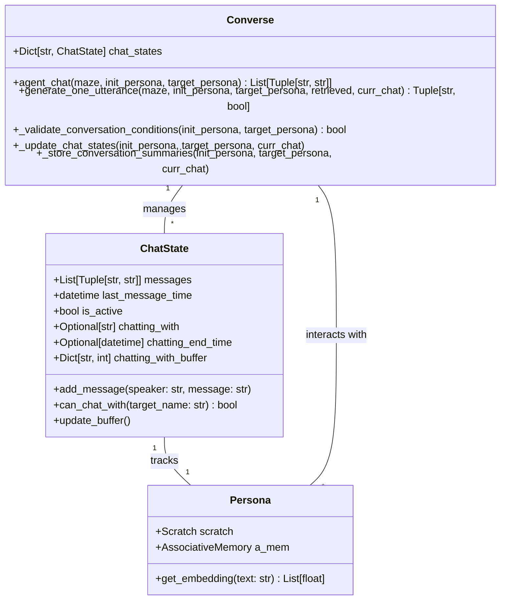
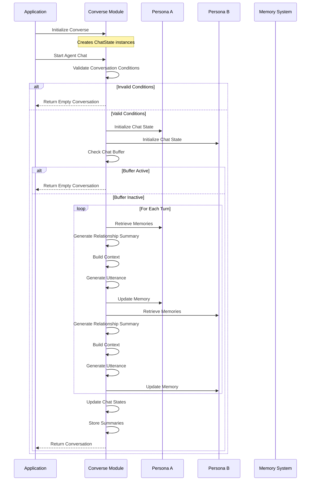
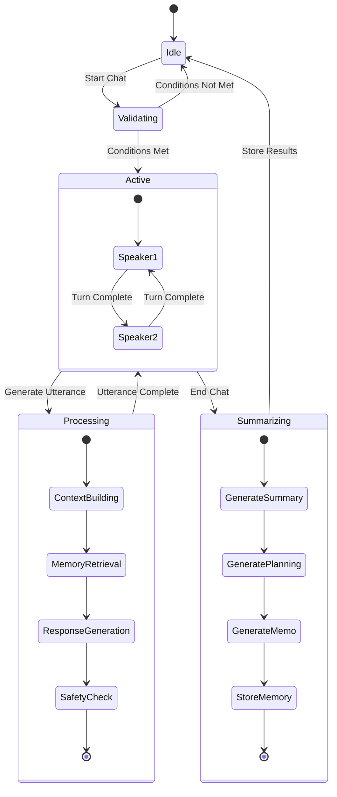

# Converse Module Overview

The Converse module manages conversation generation and processing for generative agents, handling both agent-to-agent and agent-to-user interactions.

## Key Components

### 1. Mental Models



### 2. Execution Control Flow



### 3. State Management



## Key Features

### 1. Conversation Management
- **State Tracking**: Maintains conversation state for each persona
- **Buffer System**: Prevents infinite conversation loops
- **Validation**: Ensures valid conversation conditions
- **Safety Checks**: Validates input safety scores

### 2. Memory Integration
- **Conversation Storage**: Stores conversation summaries
- **Planning Thoughts**: Captures planning insights
- **Memos**: Stores important conversation points
- **Relationship Tracking**: Maintains persona relationships

### 3. Error Handling
- **Validation Failures**: Graceful handling of invalid conditions
- **Memory Errors**: Robust error handling for memory operations
- **Generation Errors**: Fallback mechanisms for failed generations

## Implementation Details

### 1. Conversation Generation
```python
def agent_chat(self, maze, init_persona, target_persona, max_turns=8):
    # Validate conditions
    if not self._validate_conversation_conditions(init_persona, target_persona):
        return []
    
    # Initialize states
    self._initialize_chat_states(init_persona, target_persona)
    
    # Generate conversation
    curr_chat = []
    for _ in range(max_turns):
        # Generate utterances
        utt1, end1 = self._generate_utterance(init_persona, target_persona)
        if end1: break
        
        utt2, end2 = self._generate_utterance(target_persona, init_persona)
        if end2: break
    
    # Update states and store summaries
    self._update_chat_states(init_persona, target_persona, curr_chat)
    return curr_chat
```

### 2. State Management
```python
def _update_chat_states(self, init_persona, target_persona, curr_chat):
    # Calculate duration
    convo_length = self._calculate_conversation_length(curr_chat)
    end_time = init_persona.scratch.curr_time + timedelta(minutes=convo_length)
    
    # Update states
    self.chat_states[init_persona.scratch.name].chatting_end_time = end_time
    self.chat_states[target_persona.scratch.name].chatting_end_time = end_time
    
    # Update buffers
    self._update_chat_buffers(init_persona, target_persona)
    
    # Store summaries
    self._store_conversation_summaries(init_persona, target_persona, curr_chat)
```

### 3. Memory Integration
```python
def _store_in_memory(self, persona, convo_summary, planning_thought, memo, other_persona):
    try:
        # Store conversation
        persona.a_mem.add_conversation(
            created=persona.scratch.curr_time,
            expiration=persona.scratch.curr_time + timedelta(days=30),
            description=convo_summary,
            other_persona=other_persona
        )
        
        # Store thoughts
        persona.a_mem.add_thought(
            created=persona.scratch.curr_time,
            expiration=persona.scratch.curr_time + timedelta(days=30),
            description=planning_thought,
            thought_type="planning"
        )
        
        # Store memo
        persona.a_mem.add_thought(
            created=persona.scratch.curr_time,
            expiration=persona.scratch.curr_time + timedelta(days=30),
            description=memo,
            thought_type="memo"
        )
    except Exception as e:
        logger.error(f"Error storing conversation summaries: {e}")
```

## Design Patterns Used

1. **State Pattern**: Manages conversation states and transitions
2. **Observer Pattern**: Tracks changes in conversation state
3. **Strategy Pattern**: Different generation strategies for different contexts
4. **Factory Pattern**: Creates appropriate memory entries
5. **Command Pattern**: Encapsulates conversation actions

## Performance Considerations

1. **Memory Management**:
   - Efficient memory storage and retrieval
   - Buffer system to prevent memory bloat
   - Automatic cleanup of expired entries

2. **Generation Optimization**:
   - Caching of frequently used prompts
   - Batch processing where possible
   - Early termination on invalid conditions

3. **State Updates**:
   - Minimal state updates
   - Atomic operations
   - Efficient buffer management

4. **Error Handling**:
   - Graceful degradation
   - Comprehensive logging
   - Recovery mechanisms

Would you like me to elaborate on any specific aspect of the implementation?
