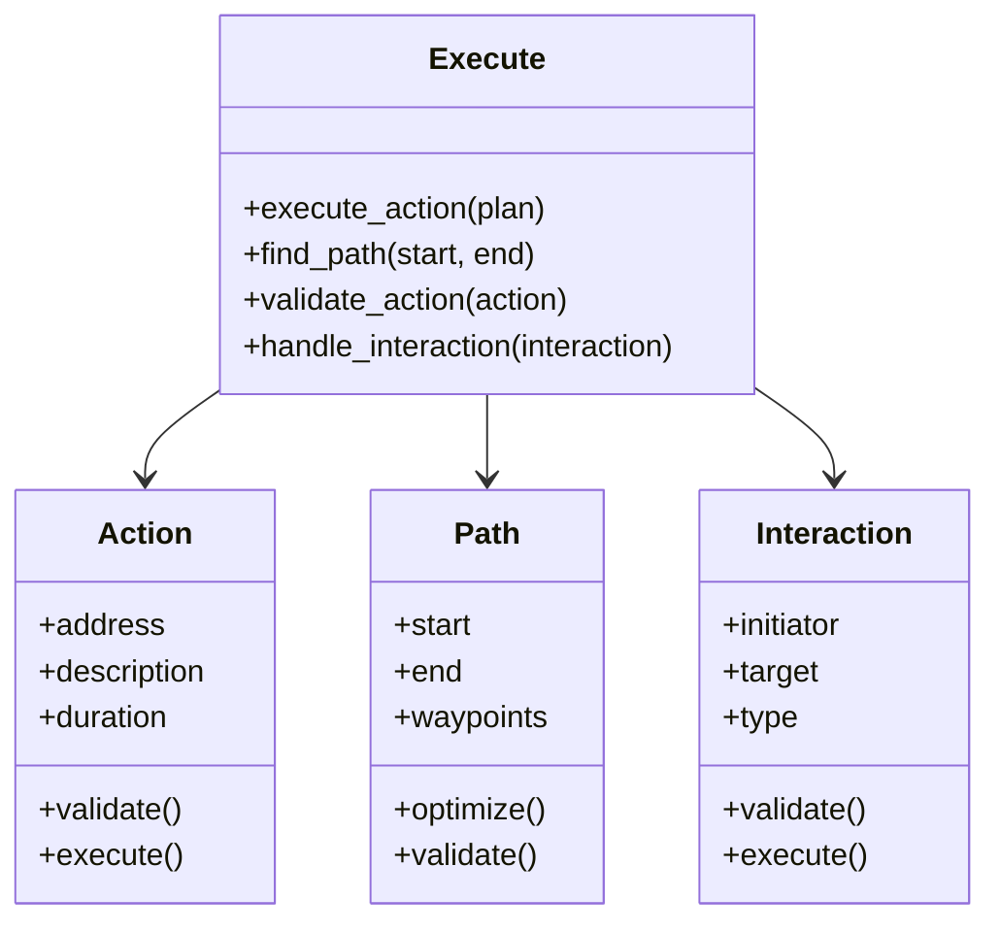
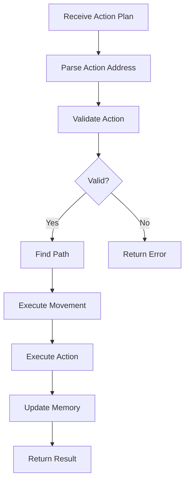

# Execute Module V2

## Overview
The Execute module is responsible for translating high-level action plans into concrete movements and interactions within the virtual environment. It handles pathfinding, action execution, and interaction management between personas.

## V1 vs V2 Implementation Comparison

### V1 Implementation
- Simple pathfinding using basic collision detection
- Direct execution of action plans without validation
- Limited interaction handling between personas
- Basic action address parsing
- No structured error handling or logging

### V2 Implementation
- Sophisticated pathfinding with multiple strategies
- Action validation and safety checks
- Enhanced interaction management
- Structured action address parsing
- Comprehensive error handling and logging
- Type safety and data validation
- Memory integration for action history

## Key Improvements in V2

1. **Structured Action Representation**
   - `Action` dataclass for type-safe action handling
   - `Path` dataclass for movement planning
   - `Interaction` dataclass for persona interactions

2. **Enhanced Pathfinding**
   - Multiple pathfinding strategies (A*, Dijkstra, etc.)
   - Collision avoidance with dynamic objects
   - Path optimization for efficiency
   - Path validation and safety checks

3. **Action Validation**
   - Pre-execution validation of actions
   - Safety checks for interactions
   - Resource availability verification
   - Permission and access control

4. **Memory Integration**
   - Action history tracking
   - Interaction memory storage
   - Path memory for optimization
   - Learning from past executions

5. **Error Handling**
   - Structured exception hierarchy
   - Detailed error logging
   - Graceful fallbacks
   - Recovery mechanisms

## Usage Example

```python
from reverie.backend_server.persona.cognitive_modules.v2.execute import Execute

# Initialize the execute module
execute = Execute(persona, maze, personas)

# Execute an action plan
result = execute.execute_action(plan)

# Handle the result
if result.success:
    print(f"Action executed: {result.description}")
else:
    print(f"Action failed: {result.error}")
```

## Design Patterns Used

1. **Strategy Pattern**
   - Different pathfinding algorithms
   - Multiple interaction strategies
   - Various validation approaches

2. **Command Pattern**
   - Action execution as commands
   - Undo/redo capability
   - Command queuing

3. **Observer Pattern**
   - Action execution events
   - Path updates
   - Interaction notifications

4. **State Pattern**
   - Action execution states
   - Pathfinding states
   - Interaction states

5. **Factory Pattern**
   - Action creation
   - Path generation
   - Interaction instantiation

## Memory System Architecture



## Execution Process Flow



## Implementation Details

### Action Address Parsing
```python
@dataclass
class ActionAddress:
    world: str
    sector: str
    arena: str
    game_object: Optional[str] = None

    @classmethod
    def from_string(cls, address: str) -> 'ActionAddress':
        parts = address.split(':')
        return cls(
            world=parts[0],
            sector=parts[1],
            arena=parts[2],
            game_object=parts[3] if len(parts) > 3 else None
        )
```

### Pathfinding
```python
class PathFinder:
    def find_path(self, start: Tuple[int, int], end: Tuple[int, int]) -> Path:
        # Implementation of A* algorithm with optimizations
        pass

    def validate_path(self, path: Path) -> bool:
        # Check for collisions and accessibility
        pass
```

### Action Execution
```python
class ActionExecutor:
    def execute(self, action: Action) -> ExecutionResult:
        try:
            # Validate action
            if not self.validate_action(action):
                return ExecutionResult(success=False, error="Invalid action")
            
            # Find and validate path
            path = self.find_path(action)
            if not path:
                return ExecutionResult(success=False, error="No valid path")
            
            # Execute movement
            self.execute_movement(path)
            
            # Execute action
            self.execute_action(action)
            
            # Update memory
            self.update_memory(action)
            
            return ExecutionResult(success=True)
        except Exception as e:
            return ExecutionResult(success=False, error=str(e))
```

## Key Features

1. **Action Types**
   - Movement actions
   - Interaction actions
   - Object manipulation
   - Communication actions

2. **Pathfinding Features**
   - Dynamic obstacle avoidance
   - Path optimization
   - Multi-agent coordination
   - Path memory caching

3. **Interaction Features**
   - Persona-to-persona interactions
   - Persona-to-object interactions
   - Group interactions
   - Interaction validation

4. **Memory Features**
   - Action history tracking
   - Path memory
   - Interaction memory
   - Learning from experience

5. **Safety Features**
   - Collision detection
   - Permission checking
   - Resource validation
   - Error recovery

## Performance Considerations

1. **Pathfinding Optimization**
   - Caching frequently used paths
   - Pre-computing path segments
   - Using efficient algorithms
   - Parallel path computation

2. **Memory Management**
   - Efficient action storage
   - Path memory optimization
   - Interaction history pruning
   - Memory cleanup

3. **Execution Efficiency**
   - Batch processing
   - Parallel execution
   - Resource pooling
   - Caching

4. **Error Handling**
   - Fast error detection
   - Efficient recovery
   - Minimal state corruption
   - Graceful degradation 