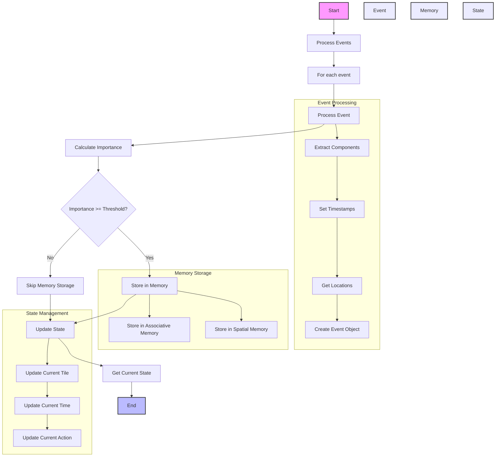

# Perceive Overview

```mermaid
flowchart TD
    A[Start] --> B[Process Events]
    B --> C[For each event]
    C --> D[Process Event]
    D --> E[Calculate Importance]
    E --> F{Importance >= Threshold?}
    F -->|Yes| G[Store in Memory]
    F -->|No| H[Skip Memory Storage]
    G --> I[Update State]
    H --> I
    I --> J[Get Current State]
    J --> K[End]

    subgraph Event Processing
        D --> D1[Extract Components]
        D1 --> D2[Set Timestamps]
        D2 --> D3[Get Locations]
        D3 --> D4[Create Event Object]
    end

    subgraph Memory Storage
        G --> G1[Store in Associative Memory]
        G --> G2[Store in Spatial Memory]
    end

    subgraph State Management
        I --> I1[Update Current Tile]
        I1 --> I2[Update Current Time]
        I2 --> I3[Update Current Action]
    end

    style A fill:#f9f,stroke:#333,stroke-width:2px
    style K fill:#bbf,stroke:#333,stroke-width:2px
    style Event Processing fill:#f96,stroke:#333,stroke-width:2px
    style Memory Storage fill:#9f6,stroke:#333,stroke-width:2px
    style State Management fill:#69f,stroke:#333,stroke-width:2px
```