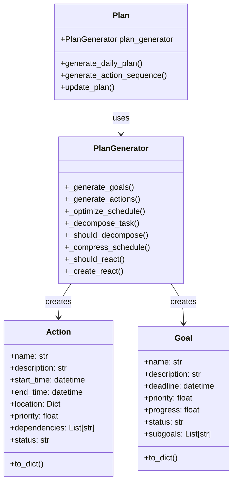
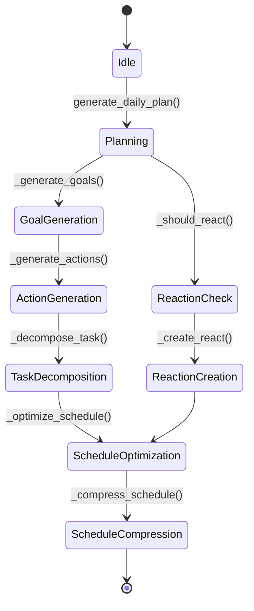
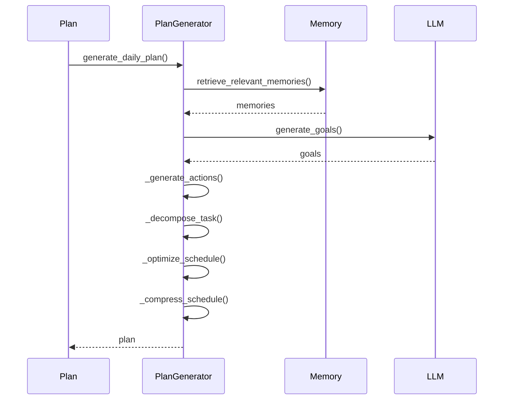
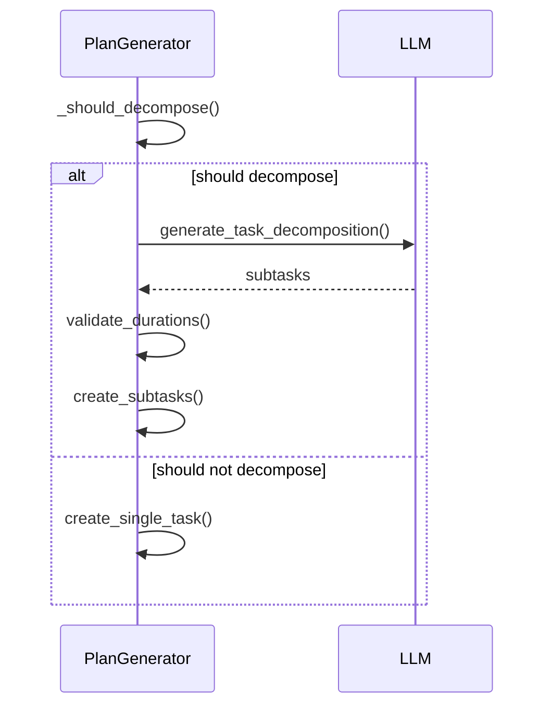
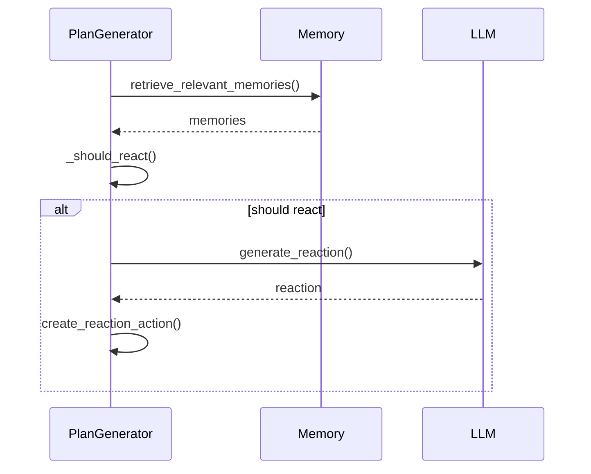

# Plan Module Control Flow

## Overview

The Plan module implements a sophisticated planning system for generative agents, following a clear control flow from high-level goals to concrete actions and schedules. This document explains the implementation details of the control flow.

## Mental Models

### Class Diagram



### State Machine



## Execution Control Flow

### Main Planning Flow



### Task Decomposition Flow



### Reaction Handling Flow



## Design Patterns

1. **Strategy Pattern**
   - Different planning strategies for different types of goals
   - Configurable priority calculation
   - Extensible schedule optimization
   - Example: `_optimize_schedule()` uses different strategies based on action types

2. **Factory Pattern**
   - Goal object creation
   - Action object creation
   - Schedule object creation
   - Example: `_create_react()` creates reaction actions

3. **State Pattern**
   - Goal state transitions
   - Action state management
   - Schedule state tracking
   - Example: Action status transitions (pending → active → completed)

4. **Observer Pattern**
   - Memory updates trigger plan updates
   - State changes notify dependent components
   - Schedule changes propagate to affected actions
   - Example: Reaction handling based on memory updates

5. **Composite Pattern**
   - Task decomposition into subtasks
   - Hierarchical goal structure
   - Nested action dependencies
   - Example: `_decompose_task()` creates task hierarchies

## Implementation Details

### 1. Goal Generation

```python
def _generate_goals(self, persona: Any, current_state: Dict[str, Any]) -> List[Goal]:
    """Generate goals based on current state and persona."""
    try:
        goals = []
        
        # Retrieve relevant memories
        memories = persona.a_mem.retrieve_memories(
            query="daily goals",
            limit=5
        )
        
        # Generate goals from memories
        for memory in memories:
            goal = Goal(
                name=f"Goal_{len(goals)}",
                description=memory.description,
                deadline=current_state["current_time"] + timedelta(days=1),
                priority=self._calculate_priority(memory),
                progress=0.0,
                status="pending",
                subgoals=[]
            )
            goals.append(goal)
        
        return goals
    except Exception as e:
        logger.error(f"Error generating goals: {e}")
        return []
```

### 2. Task Decomposition

```python
def _decompose_task(self, task: str, duration: int) -> List[Dict[str, Any]]:
    """Decompose a task into smaller subtasks."""
    try:
        # Get task decomposition from LLM
        decomposition = self.persona.llm.generate_task_decomposition(
            task=task,
            duration=duration
        )
        
        # Validate decomposition
        total_duration = sum(subtask["duration"] for subtask in decomposition)
        if total_duration != duration:
            # Adjust durations proportionally
            for subtask in decomposition:
                subtask["duration"] = int(subtask["duration"] * duration / total_duration)
        
        return decomposition
    except Exception as e:
        logger.error(f"Error decomposing task: {e}")
        return [{"description": task, "duration": duration}]
```

### 3. Schedule Optimization

```python
def _optimize_schedule(self, actions: List[Action], start_time: datetime) -> List[Action]:
    """Optimize schedule by compressing and reordering actions."""
    try:
        # Sort by priority and start time
        schedule = {}
        current_time = start_time
        
        # Sort actions by priority
        sorted_actions = sorted(actions, key=lambda x: x.priority, reverse=True)
        
        # Allocate time slots
        for action in sorted_actions:
            schedule[current_time] = action
            current_time += self.time_slot_duration
        
        # Compress schedule
        compressed_schedule = self._compress_schedule(sorted_actions)
        
        # Ensure no time gaps
        for i in range(len(compressed_schedule) - 1):
            if compressed_schedule[i].end_time < compressed_schedule[i + 1].start_time:
                # Add filler action
                filler = Action(
                    name=f"Filler_{i}",
                    description="Free time",
                    start_time=compressed_schedule[i].end_time,
                    end_time=compressed_schedule[i + 1].start_time,
                    location=compressed_schedule[i].location,
                    priority=0.1,
                    dependencies=[],
                    status="pending",
                )
                compressed_schedule.insert(i + 1, filler)
        
        return compressed_schedule
    except Exception as e:
        logger.error(f"Error optimizing schedule: {e}")
        return []
```

## Key Features

1. **Goal Management**
   - Hierarchical goal structure
   - Priority-based goal selection
   - Progress tracking
   - Deadline management

2. **Action Planning**
   - Task decomposition
   - Dependency management
   - Location-based planning
   - Priority-based scheduling

3. **Schedule Management**
   - Time slot optimization
   - Schedule compression
   - Gap filling
   - Priority-based ordering

4. **Reaction Handling**
   - Memory-based reaction triggers
   - Context-aware reactions
   - Priority-based reaction scheduling
   - Location-based reaction validation

5. **Memory Integration**
   - Memory-based goal generation
   - Context-aware planning
   - Historical pattern recognition
   - Priority calculation based on memory importance

## Performance Considerations

1. **Memory Management**
   - Efficient memory retrieval
   - Caching of frequently accessed memories
   - Memory pruning for old/unused data
   - Batch processing of memory operations

2. **Schedule Optimization**
   - Efficient sorting algorithms
   - Parallel processing of independent actions
   - Caching of optimized schedules
   - Incremental schedule updates

3. **Task Decomposition**
   - Batch processing of similar tasks
   - Caching of common decompositions
   - Parallel processing of independent subtasks
   - Efficient duration validation

4. **Reaction Handling**
   - Efficient memory scanning
   - Quick location validation
   - Caching of common reactions
   - Batch processing of reaction checks