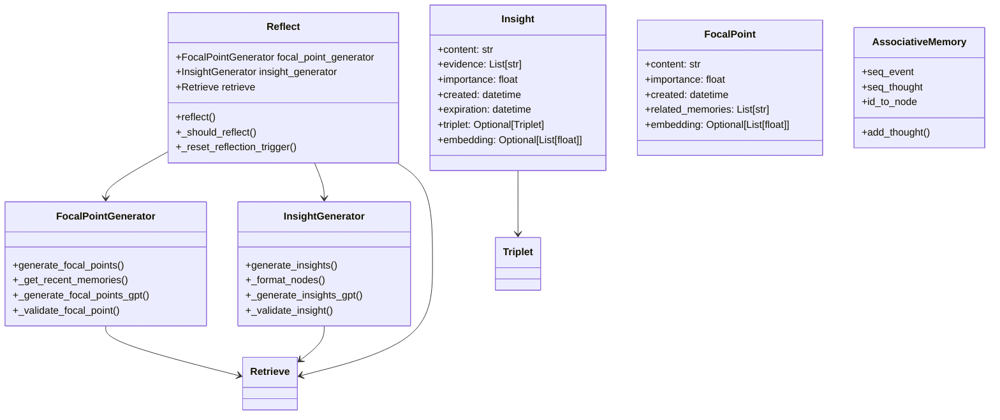
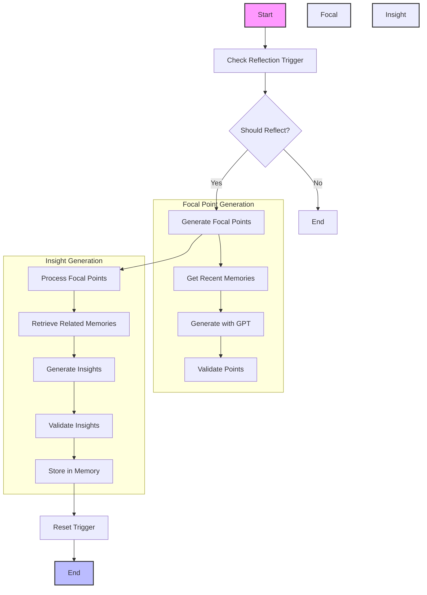

# Reflect Module Documentation

## Overview

The Reflect module is responsible for reflection and insight generation in generative agents. It handles focal point generation, insight extraction, memory analysis, and reflection triggering across different memory systems.

## V1 vs V2 Implementation Comparison

### V1 Implementation

The V1 implementation (`v1/reflect.py`) used a simpler but effective approach:

```python
def run_reflect(persona):
    # Generate focal points
    focal_points = generate_focal_points(persona, 3)
    
    # Retrieve relevant nodes
    retrieved = new_retrieve(persona, focal_points)
    
    # Generate insights
    for focal_pt, nodes in retrieved.items():
        thoughts = generate_insights_and_evidence(persona, nodes, 5)
        for thought, evidence in thoughts.items():
            # Store thought in memory
            persona.a_mem.add_thought(...)
```

Key features of V1:
1. **Simple Focal Point Generation**
   - Used GPT to generate focal points from recent memories
   - Limited to a fixed number of points
   - Basic importance filtering

2. **Insight Generation**
   ```python
   def generate_insights_and_evidence(persona, nodes, n):
       statements = ""
       for count, node in enumerate(nodes):
           statements += f'{str(count)}. {node.embedding_key}\n'
       ret = run_gpt_prompt_insight_and_guidance(persona, statements, n)[0]
   ```
   - Used GPT to generate insights from memory nodes
   - Linked insights to evidence nodes
   - Basic validation of insights

3. **Reflection Trigger System**
   ```python
   def reflection_trigger(persona):
       return (
           persona.scratch.importance_trigger_curr <= 0 and
           [] != persona.a_mem.seq_event + persona.a_mem.seq_thought
       )
   ```
   - Used importance-based triggering
   - Simple counter-based mechanism
   - Basic reset functionality

4. **Memory Integration**
   ```python
   def generate_action_event_triple(act_desp, persona):
       return run_gpt_prompt_event_triple(act_desp, persona)[0]
   ```
   - Converted actions/events to SPO triplets
   - Stored insights in associative memory
   - Basic importance scoring

### V2 Implementation

The V2 implementation (`v2/reflect.py`) builds upon V1 with several improvements:

1. **Structured Memory Representation**
   ```python
   @dataclass
   class Insight:
       content: str
       evidence: List[str]
       importance: float
       created: datetime
       expiration: datetime
       triplet: Optional[Triplet] = None
       embedding: Optional[List[float]] = None

   @dataclass
   class FocalPoint:
       content: str
       importance: float
       created: datetime
       related_memories: List[str]
       embedding: Optional[List[float]] = None
   ```
   - Uses dataclasses for type safety
   - Includes comprehensive metadata
   - Supports SPO triplets
   - Tracks memory relationships

2. **Sophisticated Focal Point Generation**
   ```python
   class FocalPointGenerator:
       def generate_focal_points(self, n: Optional[int] = None) -> List[FocalPoint]:
           recent_memories = self._get_recent_memories()
           focal_points = self._generate_focal_points_gpt(recent_memories, n)
           return [p for p in focal_points if self._validate_focal_point(p)]
   ```
   - Configurable number of points
   - Importance-based validation
   - Memory relationship tracking
   - Embedding support

3. **Enhanced Insight Generation**
   ```python
   class InsightGenerator:
       def generate_insights(self, nodes: List[Any], n: Optional[int] = None) -> Dict[str, List[str]]:
           statements = self._format_nodes(nodes)
           insights = self._generate_insights_gpt(statements, n)
           return {i: e for i, e in insights.items() if self._validate_insight(i, e)}
   ```
   - Configurable number of insights
   - Evidence-based validation
   - Importance scoring
   - SPO triplet generation

4. **Improved Reflection Trigger System**
   ```python
   def _should_reflect(self) -> bool:
       return (
           self.persona.scratch.importance_trigger_curr <= 0 and
           bool(self.persona.a_mem.seq_event + self.persona.a_mem.seq_thought)
       )
   ```
   - More robust triggering
   - Better error handling
   - Configurable thresholds
   - Memory state awareness

5. **Memory Integration**
   ```python
   def _store_insights(self, insights: Dict[str, List[str]], focal_point: FocalPoint) -> None:
       for thought, evidence in insights.items():
           triplet = self._generate_triplet(thought)
           importance = self._calculate_thought_importance(thought, evidence)
           self.persona.a_mem.add_thought(...)
   ```
   - Structured memory storage
   - Evidence tracking
   - Importance scoring
   - SPO triplet support

## Key Improvements in V2

1. **Type Safety and Structure**
   - Uses Python type hints
   - Dataclasses for memory representation
   - Clear interfaces between components
   - Structured SPO triplet handling

2. **Memory Management**
   - Tracks memory relationships
   - Maintains evidence links
   - Supports memory expiration
   - Better memory organization

3. **Insight Generation**
   - More sophisticated validation
   - Better evidence handling
   - Improved importance scoring
   - SPO-based relationship tracking

4. **Performance Optimization**
   - Configurable limits
   - Efficient memory access
   - Better error handling
   - Optimized GPT usage

5. **Extensibility**
   - Modular design
   - Clear separation of concerns
   - Configurable parameters
   - Flexible insight generation

## Usage Example

```python
# Initialize the reflect module
reflector = Reflect(persona)

# Run reflection
reflector.reflect()

# Access generated insights
for insight in persona.a_mem.seq_thought:
    print(f"Content: {insight.content}")
    print(f"Importance: {insight.poignancy}")
    print(f"Evidence: {insight.evidence}")
    if insight.triplet:
        print(f"Subject: {insight.triplet.subject}")
        print(f"Predicate: {insight.triplet.predicate}")
        print(f"Object: {insight.triplet.object}")
```

## Design Patterns Used

1. **Strategy Pattern**
   - Different generation strategies for focal points and insights
   - Configurable validation strategies
   - Flexible importance calculation

2. **Factory Pattern**
   - Creates appropriate objects for different memory types
   - Handles insight and focal point generation
   - Manages SPO triplet creation

3. **Chain of Responsibility**
   - Multi-stage reflection process
   - Sequential insight generation
   - Cascading validation

4. **Observer Pattern**
   - Memory update notifications
   - Reflection trigger monitoring
   - Insight generation tracking

5. **Decorator Pattern**
   - Additional processing for different memory types
   - Importance score transformation
   - Evidence validation

## Memory System Architecture



## Reflection Process Flow



## Implementation Details

### 1. Focal Point Generation

The focal point generation is implemented in the `FocalPointGenerator` class:

```python
class FocalPointGenerator:
    def generate_focal_points(self, n: Optional[int] = None) -> List[FocalPoint]:
        try:
            n = n or self.max_focal_points
            
            # Get recent memories
            recent_memories = self._get_recent_memories()
            
            # Generate focal points using GPT
            focal_points = self._generate_focal_points_gpt(recent_memories, n)
            
            # Process and validate focal points
            processed_points = []
            for point in focal_points:
                if self._validate_focal_point(point):
                    processed_points.append(point)
            
            return processed_points[:n]
        except Exception as e:
            logger.error(f"Error generating focal points: {e}")
            return []
```

### 2. Insight Generation

The insight generation is implemented in the `InsightGenerator` class:

```python
class InsightGenerator:
    def generate_insights(self, nodes: List[Any], n: Optional[int] = None) -> Dict[str, List[str]]:
        try:
            n = n or self.max_insights
            
            # Format nodes for GPT
            statements = self._format_nodes(nodes)
            
            # Generate insights using GPT
            insights = self._generate_insights_gpt(statements, n)
            
            # Process and validate insights
            processed_insights = {}
            for insight, evidence in insights.items():
                if self._validate_insight(insight, evidence):
                    processed_insights[insight] = evidence
            
            return processed_insights
        except Exception as e:
            logger.error(f"Error generating insights: {e}")
            return {}
```

### 3. Reflection Process

The main reflection process is implemented in the `Reflect` class:

```python
class Reflect:
    def reflect(self) -> None:
        try:
            # Check if reflection should be triggered
            if not self._should_reflect():
                return
            
            # Generate focal points
            focal_points = self.focal_point_generator.generate_focal_points()
            
            # Process each focal point
            for point in focal_points:
                # Retrieve relevant memories
                memories = self.retrieve.retrieve_memories(
                    query=point.content,
                    limit=10
                )
                
                # Generate insights
                insights = self.insight_generator.generate_insights(memories)
                
                # Store insights
                self._store_insights(insights, point)
            
            # Reset reflection trigger
            self._reset_reflection_trigger()
        except Exception as e:
            logger.error(f"Error in reflection process: {e}")
```

## Key Implementation Features

1. **Error Handling**
   - Each major method includes try-except blocks
   - Errors are logged with detailed messages
   - Methods return safe default values on error

2. **Memory Integration**
   - Searches across multiple memory systems
   - Maintains memory relationships
   - Tracks evidence and importance
   - Supports SPO triplets

3. **Insight Generation**
   - Sophisticated validation
   - Evidence-based filtering
   - Importance scoring
   - Relationship tracking

4. **Reflection Process**
   - Configurable triggering
   - Efficient memory access
   - Smart insight generation
   - Proper cleanup

5. **Performance Optimization**
   - Result limiting
   - Efficient filtering
   - Smart sorting
   - Optimized GPT usage

This implementation follows a clear, step-by-step process that transforms memories into insights, while maintaining flexibility and error resilience throughout the process. The addition of structured data types and improved validation makes the reflection process more robust and maintainable. 

----

## Focal Points:
I'll explain the focal point system in detail, comparing both V1 and V2 implementations.

### Focal Point Creation Process

In both versions, focal points are created through a multi-step process:

1. **Memory Collection**
   - V1: Collects recent events and thoughts from associative memory
   ```python
   nodes = [[i.last_accessed, i]
            for i in persona.a_mem.seq_event + persona.a_mem.seq_thought
            if "idle" not in i.embedding_key]
   ```
   - V2: More structured approach with dedicated methods
   ```python
   def _get_recent_memories(self) -> List[Dict[str, Any]]:
       memories = []
       # Get recent events
       for event in self.persona.a_mem.seq_event[-self.persona.scratch.importance_ele_n:]:
           if "idle" not in event.embedding_key:
               memories.append({
                   "content": event.embedding_key,
                   "importance": event.poignancy,
                   "created": event.created,
                   "node_id": event.node_id
               })
       # Get recent thoughts
       for thought in self.persona.a_mem.seq_thought[-self.persona.scratch.importance_ele_n:]:
           memories.append({
               "content": thought.embedding_key,
               "importance": thought.poignancy,
               "created": thought.created,
               "node_id": thought.node_id
           })
       return sorted(memories, key=lambda x: x["created"], reverse=True)
   ```

2. **GPT Generation**
   - V1: Simple prompt-based generation
   ```python
   statements = ""
   for node in nodes[-1*persona.scratch.importance_ele_n:]: 
       statements += node.embedding_key + "\n"
   return run_gpt_prompt_focal_pt(persona, statements, n)[0]
   ```
   - V2: More sophisticated with validation and relationship tracking
   ```python
   def _generate_focal_points_gpt(self, memories: List[Dict[str, Any]], n: int) -> List[FocalPoint]:
       statements = "\n".join([m["content"] for m in memories])
       focal_points = self.persona.llm.generate_focal_points(
           statements=statements, n=n, persona=self.persona
       )
       processed_points = []
       for point in focal_points:
           related_memories = self._find_related_memories(point, memories)
           processed_points.append(FocalPoint(
               content=point,
               importance=self._calculate_importance(point, related_memories),
               created=datetime.now(),
               related_memories=[m["node_id"] for m in related_memories],
               embedding=self._get_embedding(point)
           ))
       return processed_points
   ```

### Purpose and Usage of Focal Points

Focal points serve several key purposes in the reflection system:

1. **Memory Organization**
   - Act as "lenses" through which to view and analyze memories
   - Help organize related memories into meaningful clusters
   - Provide context for insight generation

2. **Insight Generation**
   - Used as starting points for deeper analysis
   - Help focus the reflection process on specific aspects of memory
   - Guide the retrieval of relevant memories for insight generation

3. **Importance Filtering**
   - V1: Basic filtering based on importance
   ```python
   if "idle" not in i.embedding_key:  # Filter out idle events
   ```
   - V2: Sophisticated importance calculation
   ```python
   def _calculate_importance(self, point: str, related_memories: List[Dict[str, Any]]) -> float:
       if not related_memories:
           return 0.0
       total_importance = sum(m["importance"] for m in related_memories)
       return total_importance / len(related_memories)
   ```

4. **Memory Relationship Tracking**
   - V1: No explicit relationship tracking
   - V2: Maintains explicit relationships between focal points and memories
   ```python
   @dataclass
   class FocalPoint:
       content: str
       importance: float
       created: datetime
       related_memories: List[str]  # List of node_ids
       embedding: Optional[List[float]] = None
   ```

### Key Improvements in V2

1. **Structured Representation**
   - Uses dataclasses for type safety
   - Includes comprehensive metadata
   - Tracks memory relationships explicitly

2. **Validation System**
   ```python
   def _validate_focal_point(self, point: FocalPoint) -> bool:
       return (
           point.importance >= self.min_importance and 
           len(point.related_memories) > 0
       )
   ```

3. **Memory Relationship Management**
   ```python
   def _find_related_memories(self, point: str, memories: List[Dict[str, Any]]) -> List[Dict[str, Any]]:
       results = self.retrieve.retrieve_memories(query=point, limit=5)
       related_memories = []
       for result in results:
           for memory in memories:
               if memory["node_id"] == result["node_id"]:
                   related_memories.append(memory)
                   break
       return related_memories
   ```

4. **Configurable Parameters**
   ```python
   def __init__(self, persona: Any):
       self.persona = persona
       self.retrieve = Retrieve(persona)
       self.max_focal_points = 3
       self.min_importance = 0.3
   ```

The focal point system is crucial for the reflection process as it:
1. Provides structure to the reflection process
2. Helps identify important patterns in memories
3. Guides the generation of meaningful insights
4. Maintains relationships between different memories
5. Filters out less important or irrelevant information


### V1 Generation pattern

In V1, the focal point generation was simpler and used a basic prompt:

```python
def generate_focal_points(persona, n=3): 
    # Get recent memories
    nodes = [[i.last_accessed, i]
             for i in persona.a_mem.seq_event + persona.a_mem.seq_thought
             if "idle" not in i.embedding_key]
    
    # Sort by last accessed time
    nodes = sorted(nodes, key=lambda x: x[0])
    nodes = [i for created, i in nodes]
    
    # Format statements for GPT
    statements = ""
    for node in nodes[-1*persona.scratch.importance_ele_n:]: 
        statements += node.embedding_key + "\n"
    
    # Generate focal points using GPT
    return run_gpt_prompt_focal_pt(persona, statements, n)[0]
```

The prompt template used was:
```
generate_focal_pt_v1.txt

Variables: 
!<INPUT 0>! -- Event/thought statements 
!<INPUT 1>! -- Count 

!<INPUT 0>!

Given only the information above, what are !<INPUT 1>! most salient high-level questions we can answer about the subjects in the statements?
1)
```

### V2 Generation pattern

In V2, the process is more sophisticated and uses a dedicated `FocalPointGenerator` class:

```python
class FocalPointGenerator:
    def __init__(self, persona: Any):
        self.persona = persona
        self.retrieve = Retrieve(persona)
        self.max_focal_points = 3
        self.min_importance = 0.3

    def generate_focal_points(self, n: Optional[int] = None) -> List[FocalPoint]:
        try:
            n = n or self.max_focal_points
            
            # Get recent memories
            recent_memories = self._get_recent_memories()
            
            # Generate focal points using GPT
            focal_points = self._generate_focal_points_gpt(recent_memories, n)
            
            # Process and validate focal points
            processed_points = []
            for point in focal_points:
                if self._validate_focal_point(point):
                    processed_points.append(point)
            
            return processed_points[:n]
        except Exception as e:
            logger.error(f"Error generating focal points: {e}")
            return []
```

The key differences in V2 are:

1. **Memory Collection**:
   ```python
   def _get_recent_memories(self) -> List[Dict[str, Any]]:
       memories = []
       # Get recent events
       for event in self.persona.a_mem.seq_event[-self.persona.scratch.importance_ele_n:]:
           if "idle" not in event.embedding_key:
               memories.append({
                   "content": event.embedding_key,
                   "importance": event.poignancy,
                   "created": event.created,
                   "node_id": event.node_id
               })
       # Get recent thoughts
       for thought in self.persona.a_mem.seq_thought[-self.persona.scratch.importance_ele_n:]:
           memories.append({
               "content": thought.embedding_key,
               "importance": thought.poignancy,
               "created": thought.created,
               "node_id": thought.node_id
           })
       return sorted(memories, key=lambda x: x["created"], reverse=True)
   ```

2. **GPT Generation**:
   ```python
   def _generate_focal_points_gpt(self, memories: List[Dict[str, Any]], n: int) -> List[FocalPoint]:
       # Format memories for GPT
       statements = "\n".join([m["content"] for m in memories])
       
       # Call GPT to generate focal points
       focal_points = self.persona.llm.generate_focal_points(
           statements=statements, n=n, persona=self.persona
       )
       
       # Process GPT output into FocalPoint objects
       processed_points = []
       for point in focal_points:
           # Find related memories
           related_memories = self._find_related_memories(point, memories)
           
           # Create FocalPoint object
           processed_points.append(FocalPoint(
               content=point,
               importance=self._calculate_importance(point, related_memories),
               created=datetime.now(),
               related_memories=[m["node_id"] for m in related_memories],
               embedding=self._get_embedding(point)
           ))
       
       return processed_points
   ```

3. **Validation**:
   ```python
   def _validate_focal_point(self, point: FocalPoint) -> bool:
       return (
           point.importance >= self.min_importance and 
           len(point.related_memories) > 0
       )
   ```

The V2 implementation uses a more sophisticated prompt that's integrated with the LLM interface:

```python
def generate_focal_points(self, statements: str, n: int, persona: Any) -> List[str]:
    prompt = f"""
    Given the following recent memories and thoughts:
    
    {statements}
    
    Generate {n} high-level questions that:
    1. Are grounded in the provided information
    2. Focus on important patterns or themes
    3. Could lead to meaningful insights
    4. Are specific enough to be answerable
    
    Format each question on a new line.
    """
    
    response = self.llm.generate(prompt)
    return [q.strip() for q in response.split('\n') if q.strip()]
```

### Key Differences in Prompting

1. **V1 Prompt**:
   - Simple question generation
   - No specific guidance on question quality
   - Basic formatting requirements

2. **V2 Prompt**:
   - More structured guidance
   - Specific criteria for question quality
   - Focus on patterns and themes
   - Emphasis on answerability
   - Better formatting requirements

The V2 implementation also includes:
- Importance scoring
- Memory relationship tracking
- Embedding generation
- Validation checks
- Error handling
- Configurable parameters

Would you like me to elaborate on any specific aspect of the focal point generation process?
