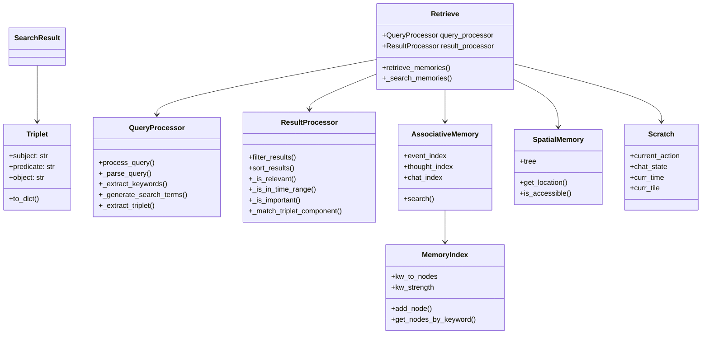
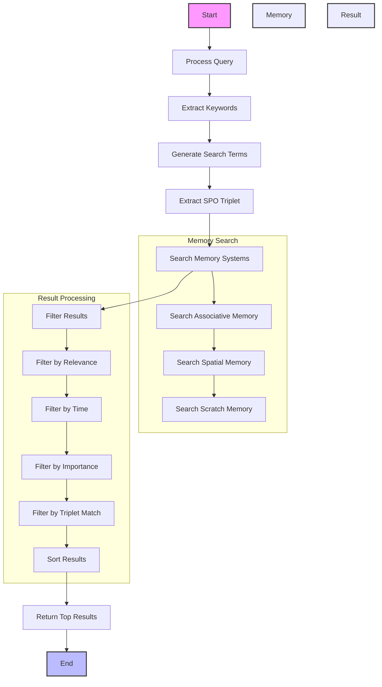

# Retrieve Module Documentation

## Overview

The Retrieve module is responsible for memory retrieval in generative agents. It handles query processing, memory search, result filtering, and result sorting across different memory systems (associative, spatial, and scratch).

## V1 vs V2 Implementation Comparison

### V1 Implementation

The V1 implementation (`v1/retrieve.py`) used a simpler but effective approach:

```python
def retrieve(persona, perceived):
    retrieved = dict()
    for event in perceived:
        retrieved[event.description] = dict()
        retrieved[event.description]["curr_event"] = event
        
        relevant_events = persona.a_mem.retrieve_relevant_events(
            event.subject, event.predicate, event.object)
        retrieved[event.description]["events"] = list(relevant_events)

        relevant_thoughts = persona.a_mem.retrieve_relevant_thoughts(
            event.subject, event.predicate, event.object)
        retrieved[event.description]["thoughts"] = list(relevant_thoughts)
```

Key features of V1:
1. **Simple Event-Based Retrieval**
   - Focused on retrieving events and thoughts related to perceived events
   - Used subject-predicate-object triplets for relevance matching

2. **Memory Scoring System**
   ```python
   def extract_recency(persona, nodes):
       recency_vals = [persona.scratch.recency_decay ** i 
                       for i in range(1, len(nodes) + 1)]
   ```
   - Used exponential decay for recency scoring
   - Applied decay based on memory position in sequence

3. **Vector Similarity Search**
   ```python
   def extract_relevance(persona, nodes, focal_pt):
       focal_embedding = get_embedding(focal_pt)
       relevance_out = dict()
       for node in nodes:
           node_embedding = persona.a_mem.embeddings[node.embedding_key]
           relevance_out[node.node_id] = cos_sim(node_embedding, focal_embedding)
   ```
   - Used cosine similarity for semantic matching
   - Stored embeddings in associative memory

4. **Normalization System**
   ```python
   def normalize_dict_floats(d, target_min, target_max):
       min_val = min(val for val in d.values())
       max_val = max(val for val in d.values())
       range_val = max_val - min_val
   ```
   - Normalized scores to consistent ranges
   - Handled edge cases for uniform values

### V2 Implementation

The V2 implementation (`v2/retrieve.py`) builds upon V1 with several improvements:

1. **Structured Memory Representation**
   ```python
   @dataclass
   class Triplet:
       """Represents a subject-predicate-object triplet."""
       subject: str
       predicate: str
       object: str

   @dataclass
   class SearchResult:
       content: str
       importance: float
       created: datetime
       memory_type: str
       metadata: Dict[str, Any]
       relevance_score: float = 0.0
       recency_score: float = 0.0
       embedding: Optional[List[float]] = None
       node_id: Optional[str] = None
       triplet: Optional[Triplet] = None
   ```
   - Uses dataclasses for type safety
   - Includes comprehensive metadata
   - Tracks memory access patterns
   - Supports SPO triplet matching

2. **Sophisticated Query Processing**
   ```python
   class QueryProcessor:
       def process_query(self, query: str) -> Tuple[List[str], List[float], Optional[Triplet]]:
           parsed_query = self._parse_query(query)
           keywords = self._extract_keywords(parsed_query)
           search_terms = self._generate_search_terms(keywords)
           query_embedding = self._get_embedding(query)
           triplet = self._extract_triplet(parsed_query)
   ```
   - Handles both keyword and semantic search
   - Generates term variations
   - Processes embeddings
   - Extracts SPO triplets from queries

3. **Enhanced Memory Decay System**
   ```python
   def _calculate_recency_scores(self, results: List[SearchResult]) -> None:
       sorted_results = sorted(results, key=lambda x: x.created, reverse=True)
       for i, result in enumerate(sorted_results):
           result.recency_score = self.recency_decay ** i
   ```
   - Applies exponential decay to all results
   - Considers memory type and access patterns
   - Updates last accessed times

4. **Multi-Memory System Integration**
   ```python
   def _search_memories(self, search_terms: List[str], query_embedding: List[float], query_triplet: Optional[Triplet]) -> List[SearchResult]:
       results = []
       # Search associative memory
       results.extend(self._process_associative_memory_results(..., triplet=query_triplet))
       # Search spatial memory
       results.extend(self._process_spatial_memory_results(..., triplet=query_triplet))
       # Search scratch memory
       results.extend(self._process_scratch_memory_results(..., triplet=query_triplet))
   ```
   - Unified interface for all memory systems
   - Type-specific result processing
   - Consistent scoring across systems
   - SPO triplet support across all memory types

5. **Improved Scoring System**
   ```python
   def _is_relevant(self, result: SearchResult, search_terms: List[str], query_embedding: List[float], query_triplet: Optional[Triplet]) -> bool:
       # Keyword-based relevance
       keyword_match = any(term in content for term in search_terms)
       
       # Vector similarity relevance
       vector_match = self._cosine_similarity(query_embedding, result.embedding) > 0.5
       
       # SPO triplet matching
       triplet_match = False
       if query_triplet and result.triplet:
           triplet_match = (
               self._match_triplet_component(query_triplet.subject, result.triplet.subject) or
               self._match_triplet_component(query_triplet.predicate, result.triplet.predicate) or
               self._match_triplet_component(query_triplet.object, result.triplet.object)
           )
       
       return keyword_match or vector_match or triplet_match
   ```
   - Configurable weights for different factors
   - Transparent scoring process
   - Better handling of edge cases
   - Multi-faceted relevance checking

## Key Improvements in V2

1. **Type Safety and Structure**
   - Uses Python type hints
   - Dataclasses for memory representation
   - Clear interfaces between components
   - Structured SPO triplet handling

2. **Memory Management**
   - Tracks memory access patterns
   - Updates last accessed times
   - Applies memory decay consistently
   - Maintains SPO relationships

3. **Search Capabilities**
   - Combines keyword and semantic search
   - Handles multiple memory systems
   - More sophisticated relevance scoring
   - SPO-based relationship matching

4. **Performance Optimization**
   - Batch processing of results
   - Efficient memory access patterns
   - Better error handling
   - Optimized triplet matching

5. **Extensibility**
   - Modular design for easy extension
   - Clear separation of concerns
   - Configurable parameters
   - Flexible triplet extraction

## Usage Example

```python
# Initialize the retrieve module
retriever = Retrieve(persona)

# Perform a memory search
results = retriever.retrieve_memories(
    query="John is playing basketball in the park",
    limit=5,
    time_range=(start_time, end_time)
)

# Process results
for result in results:
    print(f"Content: {result['content']}")
    print(f"Score: {result['relevance_score']}")
    print(f"Type: {result['memory_type']}")
    if result['triplet']:
        print(f"Subject: {result['triplet']['subject']}")
        print(f"Predicate: {result['triplet']['predicate']}")
        print(f"Object: {result['triplet']['object']}")
```

## Design Patterns Used

1. **Strategy Pattern**
   - Different search strategies for different memory types
   - Configurable scoring strategies
   - Flexible triplet matching strategies

2. **Factory Pattern**
   - Creates appropriate result objects for different memory types
   - Handles memory system-specific processing
   - Generates SPO triplets

3. **Chain of Responsibility**
   - Query processing pipeline
   - Result filtering and sorting chain
   - Triplet extraction and matching

4. **Observer Pattern**
   - Memory access tracking
   - Score updates
   - Triplet relationship updates

5. **Decorator Pattern**
   - Additional processing for different memory types
   - Score normalization and transformation
   - Triplet component matching

## Memory System Architecture



## Search Process Flow



## Implementation Details

### 1. Query Processing

The query processing is implemented in the `QueryProcessor` class:

```python
class QueryProcessor:
    def process_query(self, query: str) -> Tuple[List[str], List[float], Optional[Triplet]]:
        try:
            # Parse the query
            parsed_query = self._parse_query(query)
            
            # Extract keywords
            keywords = self._extract_keywords(parsed_query)
            
            # Generate search terms
            search_terms = self._generate_search_terms(keywords)
            
            # Get query embedding
            query_embedding = self._get_embedding(query)
            
            # Extract SPO triplet
            triplet = self._extract_triplet(parsed_query)
            
            return search_terms, query_embedding, triplet
        except Exception as e:
            logger.error(f"Error processing query: {e}")
            return [], [], None
```

### 2. Triplet Extraction

The SPO triplet extraction is implemented in the `_extract_triplet` method:

```python
def _extract_triplet(self, query: str) -> Optional[Triplet]:
    """Extract subject-predicate-object triplet from query."""
    try:
        # Simple pattern matching for now
        # This could be enhanced with NLP techniques
        words = query.split()
        if len(words) >= 3:
            # Try to find a verb (predicate)
            for i in range(1, len(words) - 1):
                if self._is_verb(words[i]):
                    return Triplet(
                        subject=" ".join(words[:i]),
                        predicate=words[i],
                        object=" ".join(words[i + 1:])
                    )
        return None
    except Exception as e:
        logger.error(f"Error extracting triplet: {e}")
        return None
```

### 3. Memory System Search

The memory search process is implemented in the `_search_memories` method:

```python
def _search_memories(
    self,
    search_terms: List[str],
    query_embedding: List[float],
    query_triplet: Optional[Triplet],
    time_range: Optional[Tuple[datetime, datetime]] = None
) -> List[SearchResult]:
    try:
        results = []
        
        # Search associative memory
        a_mem_results = self.persona.a_mem.search(
            terms=search_terms,
            triplet=query_triplet,
            time_range=time_range
        )
        results.extend([
            SearchResult(
                content=result["content"],
                importance=result["importance"],
                created=result["created"],
                memory_type="associative",
                metadata=result.get("metadata", {}),
                triplet=result.get("triplet")
            )
            for result in a_mem_results
        ])
        
        # Similar processing for spatial and scratch memory...
        
        return results
    except Exception as e:
        logger.error(f"Error searching memories: {e}")
        return []
```

### 4. Result Processing

The result processing is implemented in the `ResultProcessor` class:

```python
class ResultProcessor:
    def filter_results(
        self,
        results: List[SearchResult],
        search_terms: List[str],
        query_embedding: List[float],
        query_triplet: Optional[Triplet],
        time_range: Optional[Tuple[datetime, datetime]] = None
    ) -> List[SearchResult]:
        try:
            filtered_results = []
            
            for result in results:
                # Filter by relevance
                if not self._is_relevant(result, search_terms, query_embedding, query_triplet):
                    continue
                    
                # Filter by time
                if not self._is_in_time_range(result, time_range):
                    continue
                    
                # Filter by importance
                if not self._is_important(result):
                    continue
                    
                filtered_results.append(result)
            
            return filtered_results[:self.max_results]
        except Exception as e:
            logger.error(f"Error filtering results: {e}")
            return []
```

## Key Implementation Features

1. **Error Handling**
   - Each major method includes try-except blocks
   - Errors are logged with detailed messages
   - Methods return safe default values on error

2. **Memory Integration**
   - Searches across multiple memory systems
   - Combines results from different memory types
   - Maintains memory system independence
   - Supports SPO triplet matching across systems

3. **Query Processing**
   - Sophisticated query parsing
   - Keyword extraction
   - Search term generation
   - SPO triplet extraction

4. **Result Processing**
   - Multi-stage filtering
   - Importance-based sorting
   - Time-based filtering
   - Triplet-based matching

5. **Performance Optimization**
   - Result limiting
   - Efficient filtering
   - Smart sorting
   - Optimized triplet matching

This implementation follows a clear, step-by-step process that transforms queries into relevant memories, while maintaining flexibility and error resilience throughout the process. The addition of SPO triplet support enhances the system's ability to understand and match relationships between entities in the agent's memory. 