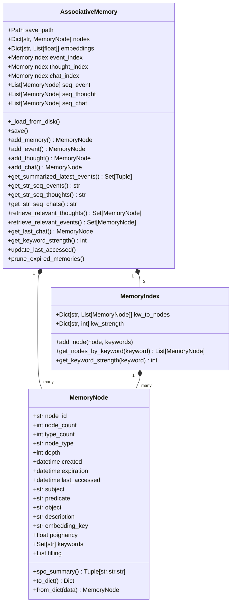
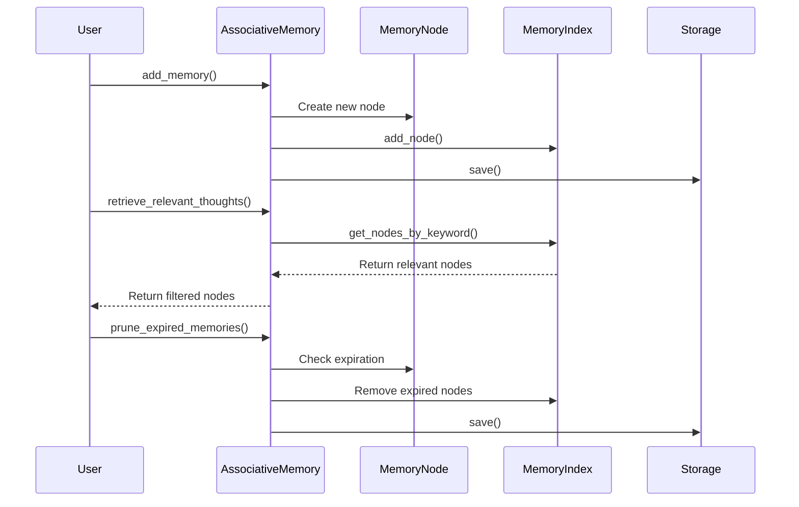
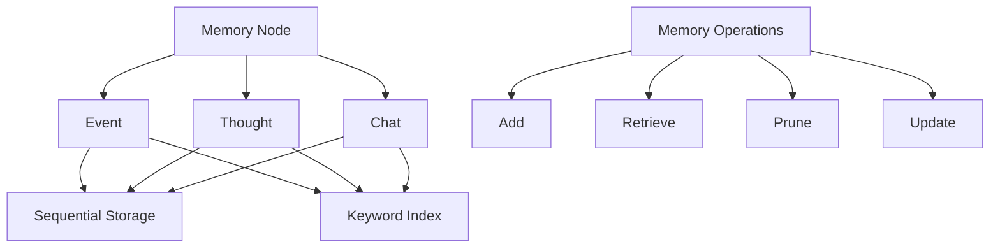

# Memory Structures v2

This directory contains the v2 implementation of the memory structures for generative agents. The implementation is cleaner, more maintainable, and follows better OOP principles.

## Modules

### Scratch (scratch.py)

The `Scratch` class represents the short-term memory module for generative agents. It maintains the current state and context of an agent, including:

1. **Persona Configuration**
   - Vision radius (how far the agent can see)
   - Attention bandwidth (how many things the agent can focus on)
   - Memory retention (how many recent events to remember)

2. **World State**
   - Current time
   - Current location (tile coordinates)
   - Daily plan requirements

3. **Persona Identity**
   - Basic information (name, age)
   - Core traits (innate, learned)
   - Current state and lifestyle
   - Living area

4. **Reflection System**
   - Memory decay parameters
   - Reflection timing and thresholds
   - Importance weighting system

5. **Planning System**
   - Daily requirements
   - Daily schedule (decomposed and hourly)
   - Current action tracking
   - Path planning

6. **Action Management**
   - Current action details
   - Action timing and duration
   - Action descriptions and events
   - Chat state management

### AssociativeMemory (associative_memory.py)

The `AssociativeMemory` class represents the long-term memory module for generative agents. It manages:

1. **Memory Nodes**
   - Events (things that happened)
   - Thoughts (internal reflections)
   - Chats (conversations)

2. **Memory Organization**
   - Keyword-based indexing
   - Sequential storage
   - Memory strength tracking

3. **Memory Operations**
   - Adding new memories
   - Retrieving relevant memories
   - Memory summarization
   - Memory persistence

### SpatialMemory (spatial_memory.py)

The `SpatialMemory` class represents the spatial memory module for generative agents. It manages:

1. **World Structure**
   - Hierarchical organization of game world
   - World -> Sector -> Arena -> Game Objects structure
   - Accessible locations tracking

2. **Location Management**
   - Current location tracking
   - Accessible sectors and arenas
   - Available game objects in locations

3. **Navigation Support**
   - Path finding information
   - Location accessibility checks
   - Spatial relationships between locations

## Associative Memory Module

The `AssociativeMemory` class is the core long-term memory system for generative agents, implementing a sophisticated memory management system with semantic associations and temporal organization.

### Class Structure



### Memory Operations Flow



### Memory Types and Relationships



### Key Features

1. **Memory Types**
   - Events: External occurrences and observations
   - Thoughts: Internal reflections and reasoning
   - Chats: Conversation records and interactions

2. **Memory Organization**
   - Sequential storage for temporal access
   - Keyword-based indexing for semantic retrieval
   - Memory strength tracking for importance
   - Expiration management for memory cleanup

3. **Memory Operations**
   - Add: Create new memories with proper indexing
   - Retrieve: Find relevant memories by keyword
   - Prune: Remove expired memories
   - Update: Track access patterns and strength

4. **Memory Persistence**
   - JSON-based storage
   - Separate files for nodes, embeddings, and keyword strengths
   - Atomic save operations
   - Error handling and recovery

### Implementation Details

1. **Memory Node Creation**
```python
node = MemoryNode(
    node_id=f"node_{node_count}",
    node_count=node_count,
    type_count=type_count,
    node_type=node_type,
    depth=depth,
    created=created,
    expiration=expiration,
    subject=subject,
    predicate=predicate,
    object=object,
    description=description,
    embedding_key=embedding_pair[0],
    poignancy=poignancy,
    keywords=keywords,
    filling=filling
)
```

2. **Memory Indexing**
```python
def add_node(self, node: MemoryNode, keywords: List[str]):
    for kw in keywords:
        kw = kw.lower()
        if kw in self.kw_to_nodes:
            self.kw_to_nodes[kw].insert(0, node)
        else:
            self.kw_to_nodes[kw] = [node]
        self.kw_strength[kw] = self.kw_strength.get(kw, 0) + 1
```

3. **Memory Retrieval**
```python
def retrieve_relevant_thoughts(self, subject: str, predicate: str, object: str) -> Set[MemoryNode]:
    contents = [subject, predicate, object]
    relevant_nodes = set()
    for content in contents:
        relevant_nodes.update(
            self.thought_index.get_nodes_by_keyword(content.lower())
        )
    return relevant_nodes
```

### Design Patterns

1. **Composite Pattern**
   - Memory nodes form a tree structure
   - Thoughts can reference other thoughts
   - Unified interface for different memory types

2. **Observer Pattern**
   - Memory indices observe node changes
   - Automatic index updates on node modifications
   - Keyword strength tracking

3. **Strategy Pattern**
   - Different indexing strategies for different memory types
   - Configurable retrieval methods
   - Flexible storage backends

4. **Factory Pattern**
   - Memory node creation through factory methods
   - Type-specific node initialization
   - Consistent node creation interface

### Performance Considerations

1. **Memory Management**
   - Efficient keyword indexing
   - Lazy loading of embeddings
   - Memory pruning for expired nodes
   - Access pattern tracking

2. **Retrieval Optimization**
   - Keyword-based pre-filtering
   - Sequential access for recent memories
   - Caching of frequently accessed nodes
   - Strength-based prioritization

3. **Storage Efficiency**
   - JSON compression
   - Incremental updates
   - Atomic save operations
   - Error recovery mechanisms

4. **Scalability**
   - Distributed indexing
   - Memory type separation
   - Efficient pruning
   - Access pattern optimization

### Usage Example

```python
# Initialize memory system
memory = AssociativeMemory("path/to/save")

# Add new event
memory.add_event(
    created=datetime.now(),
    subject="agent",
    predicate="saw",
    object="friend",
    description="Saw a friend at the park",
    keywords={"friend", "park"},
    poignancy=0.8,
    embedding_pair=("event_1", [0.1, 0.2, 0.3])
)

# Retrieve relevant thoughts
relevant_thoughts = memory.retrieve_relevant_thoughts(
    subject="friend",
    predicate="met",
    object="park"
)

# Get latest events
latest_events = memory.get_summarized_latest_events(retention=5)

# Prune expired memories
memory.prune_expired_memories()
```

## Key Improvements in v2

1. **Better Code Organization**
   - Clear separation of concerns
   - Modular design
   - Type safety with type hints

2. **Improved Documentation**
   - Clear docstrings
   - External documentation (this README)
   - Better code readability

3. **Enhanced Maintainability**
   - Reduced code duplication
   - Better error handling
   - More consistent interfaces

4. **Modern Python Features**
   - Type hints
   - Pathlib for file operations
   - Better serialization
   - Dataclasses for data structures

## Usage

The three modules work together to provide a complete memory system for generative agents:

- `Scratch` handles immediate context and short-term memory
- `AssociativeMemory` manages long-term memory and associations
- `SpatialMemory` maintains spatial awareness and navigation

Example usage:

```python
# Initialize memory system
scratch = Scratch("path/to/save")
memory = AssociativeMemory("path/to/save")
spatial = SpatialMemory("path/to/save")

# Add new memory
memory.add_event(
    created=datetime.now(),
    subject="agent",
    predicate="saw",
    object="friend",
    description="Saw a friend at the park",
    keywords={"friend", "park"},
    poignancy=0.8
)

# Update scratch state
scratch.add_new_action(
    action_address="park:main:bench",
    action_duration=30,
    action_description="sitting on a bench",
    action_pronunciatio="🧘",
    action_event=("agent", "is", "sitting")
)

# Check accessible locations
accessible_arenas = spatial.get_str_accessible_sector_arenas("park:main")
``` 